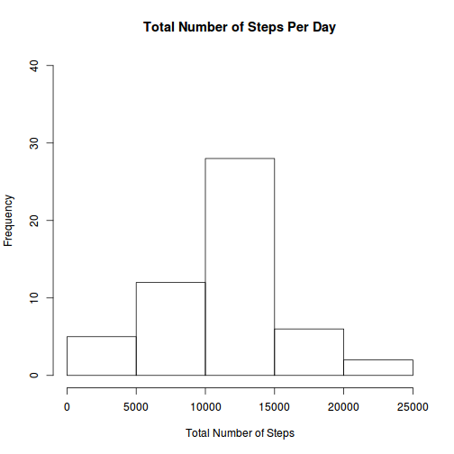
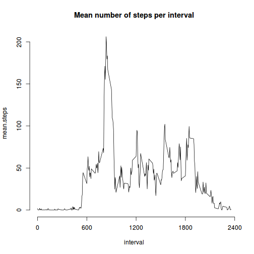
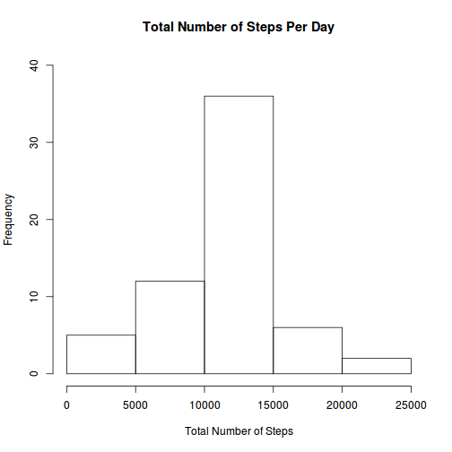
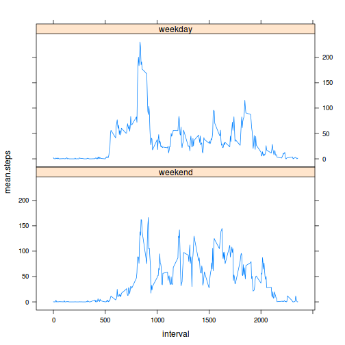

## Loading and preprocessing the data

```r
zipData <- "activity.zip"
unzip(zipData)
data <- read.csv("activity.csv")
```

Note that the interval reads as the 24 hour clock, so no further manipulation is necessary.

## What is mean total number of steps taken per day?

```r
totalStepsPerDay <- setNames(aggregate(data[,1], list(data$date), sum),c('date','sum.of.steps'))
hist(totalStepsPerDay$sum.of.steps, ylim = c(0,40), 
     main='Total Number of Steps Per Day', xlab = 'Total Number of Steps')
```

 

```r
mean(totalStepsPerDay[,2], na.rm=TRUE)
```

```
## [1] 10766.19
```

```r
median(totalStepsPerDay[,2], na.rm=TRUE)
```

```
## [1] 10765
```


## What is the average daily activity pattern?

```r
meanIntervalSteps <- setNames(aggregate(data$steps, by = list(data$interval), mean, na.rm=TRUE),
                              c('interval','mean.steps'))
plot(meanIntervalSteps, type="l", main = 'Mean number of steps per interval',axes=F)
axis(side = 2)
axis(side = 1, xlim = c(0,2400), at = seq(0,2400,600))
```

 

Which 5-minute interval, on average across all the days in the dataset, contains the maximum number of steps?

```r
setNames(aggregate(data$steps, by = list(data$interval), sum, na.rm=TRUE),
         c('interval','steps'))[which.max(aggregate(data$steps, by = list(data$interval), sum, na.rm=TRUE)$x),]
```

```
##     interval steps
## 104      835 10927
```


## Imputing missing values
total number of NA's in the data set

```r
sum(is.na(data$steps))
```

```
## [1] 2304
```


Replace each NA with the mean for that time interval.  Split the data into the subset containing NA's and not.  Replace the NA's then rbind the data back together.

```r
dataNA <- subset(data, is.na(steps))
dataNotNA <- subset(data, !is.na(steps))
for (i in unique(dataNA$interval)) {
  dataNA$steps[dataNA$interval==i] <- mean(data$steps[data$interval==i], na.rm=TRUE)
}
newData <- rbind(dataNA, dataNotNA)
newTotalStepsPerDay <- setNames(aggregate(newData[,1], list(newData$date), sum),
                                c('date', 'sum.of.steps'))
mean(newTotalStepsPerDay[,2], na.rm=TRUE)
```

```
## [1] 10766.19
```

```r
median(newTotalStepsPerDay[,2], na.rm=TRUE)
```

```
## [1] 10766.19
```

```r
hist(newTotalStepsPerDay$sum.of.steps, ylim = c(0,40),
     main='Total Number of Steps Per Day', xlab = 'Total Number of Steps')
```

 

Doesn't change the mean but does change the median.
The total number of steps changes (obvious really - changing NA's to numbers)

## Are there differences in activity patterns between weekdays and weekends?
mark on the weekends and weekdays

```r
newData$day <- weekdays(as.Date(newData$date))
weekdays <- c('Monday', 'Tuesday', 'Wednesday', 'Thursday', 'Friday')
newData$weekpart <- factor((newData$day %in% weekdays), levels=c(FALSE, TRUE), labels=c('weekend', 'weekday'))
```
Change the data into a nicer format and do a panel plot.

```r
library(lattice)
newMeanIntervalSteps <- setNames(aggregate(newData$steps, by = list(newData$interval, newData$weekpart), mean, na.rm=TRUE), 
                                 c('interval', 'weekpart', 'mean.steps'))
xyplot(mean.steps ~ interval | weekpart, data=newMeanIntervalSteps, layout=c(1,2), type="l")
```

 

You can see that the weekday and weekend weekparts have different activity
